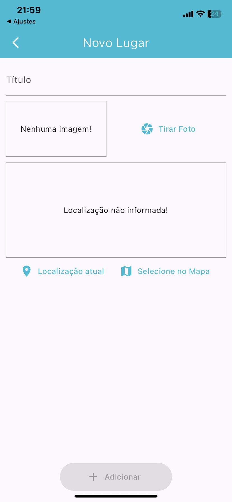
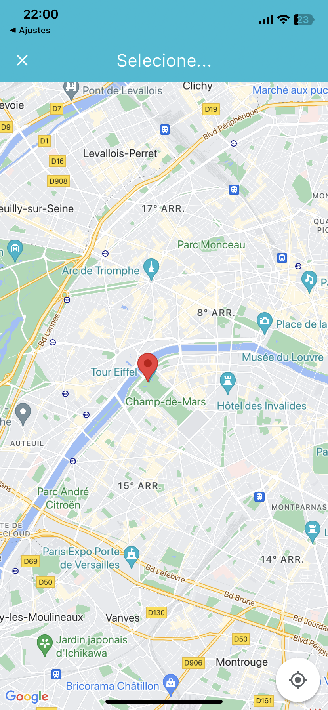

# Great Place
Este aplicativo foi feito na intenção de aprender os recursos nativos dos celulares

### O que eu aprendi neste aplicativo
Neste aplicativo, aprendi conceitos de como usar a camera do celular com ImagePicker, implementação de banco de dados SQLite...
 

### Layout

   

#### GIFS

## Como foi feito este projeto?

Este projeto foi totalmente feito a partir de um curso da udemy, na qual você pode [clicar aqui](https://www.udemy.com/course/curso-flutter/?couponCode=ST6MT42324) para acessar o curso 

Neste projeto contém estruturas de fundamentos de flutter, sendo elas:
- [X] ImagePicker;
- [X] SQLite;
- [X] LocationInput;
- [X] Configuranado Localização;
- [X] API Google Maps;
- [X] Google Maps for flutter.
- [X] Guardar dados dentro do banco de dados(SQLite)

## Dependências
- ``provider: ^6.1.2``
- ``image_picker: ^1.1.2``
- ``path_provider: ^2.1.3``
- ``path: ^1.9.0``
- ``sqflite: ^2.3.3+1``
- ``location: ^6.0.2``
- ``google_maps_flutter: ^2.5.3``
- ``http: ^1.2.1``

### Tecnologias utilizadas
- ``VSCode``
- ``Dart``
- ``Flutter``
- ``XCode = Emulador de IOs``
- ``Android Studio = Emulador Android``
- ``iPad = Emulador iPadOS``

